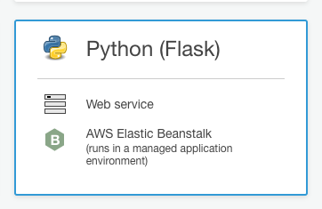

# 部署預測性維護平台

## 設置 AWS 帳號

1. 選擇  **美國俄亥俄州 (us-east-2) ** 建置以下應用
2. 創建一個 AWS 使用者帳號
3. 產生 **存取金鑰**，並下載 csv 存放

## 設置資源

### Lambda 函數

1. 至 Lambda 主控台，建立兩個新函數

   1. Telemetry
      1. 範本：`從頭開始撰寫`
      2. 名稱：`telemetry_lambda`
      3. 執行語言：`python3.6`
      4. 角色：創建新角色 `pdm-lambda`，使用預設之政策即可
   2. Logs
      1. 範本：`從頭開始撰寫`
      2. 名稱：`logs_lambda`
      3. 執行語言：`python3.6`
      4. 角色： `pdm-lambda`

2. 為 IAM 角色 `pdm-lambda` 新增政策

   1. 選擇`新增內嵌政策`

   2. 設定政策

      1. 服務： DynamoDB
      2. 操作：PutItem
      3. 資源：
         1. 選擇`指定`與`新增 ARN`
         2. 輸入 `telemetry_db` 與 `logs_db` 的 ARN
            註：ARN 可在 `telemetry_db` 與 `logs_db` 的`概觀`頁面下方找到

   3. 選擇`新增其他許可`

   4. 設定政策

      1. 服務：Kinesis
      2. 操作：PutRecord
      3. 資源：
         1. 選擇`指定`與`新增 ARN`
         2. 輸入 `telemetry_stream` 與 `logs_stream` 的 ARN
            註：ARN 可在 `telemetry_stream` 與 `logs_stream` 的`概觀`頁面找到

   5. 檢閱政策，輸入政策名稱 `LambdaWriteToKinesisStreamAndDynamoDBPolicy`

3. 執行 `Scripts/confiture_lambda.py` 更新函數並建立 AWS IoT 主題規則

   ```shell
   $ python Scripts/confiture_lambda.py
   Uploading lambda handlers...
   Creating topic rules...
   ```

4. 在 `telemetry_lambda` 與 `logs_lambda` 中，分別新增並啟用 AWS IoT 觸發條件 `telemetry_rule` 與 `logs_rule`後儲存
   


### 建立其他資源

1. 下載 `awscli`

   ```shell
   $ pip install --upgrade awscli
   ```

2. `aws configure` 設置存取權限資訊

   ```shell
   $ aws configure
   AWS Access Key ID [None]: <YOUR ACCESS KEY ID>
   AWS Secret Access Key [None]: <YOUR SECRET KEY>
   Default region name [None]: us-east-2
   Default output format [None]: json
   ```

3. 執行 `Scripts/resource_setup.py`

   ```shell
   $ python Scripts/resource_setup.py
   ...
   make_bucket: <SAGEMAKER_BUCKET>
   ...
   ```

   注意：每次執行都會產生新的存貯體 (bucket)，請記下之後要使用的存貯體名稱

   該程序會創建下列資源：

   * S3 Bucket/Object
     * `s3://<SAGEMAKER_BUCKET>`
     * `s3://<SAGEMAKER_BUCKET>/scripts/emr-install-my-jupyter-libraries.sh`
     * `s3://<SAGEMAKER_BUCKET>/scripts/samgemaker-notebook-setup.sh`
   * DynamoDB
     * `telemetry_db`
     * `logs_db`
   * Kinesis Stream
     * `telemetry_stream`
     * `logs_stream`
   * IoT 規則
     * `telemetry_rule`
     * `logs_rule`


## 利用 CodeStar 部署 Flask 應用

### 建立 CodeStar 新專案

1. 至 CodeStart 頁面，選擇建立新專案

2. 選擇 Python (Flask) 部署於 Elastic Beanstalk

   

3. 選擇 GItHub 創建新的專案 **<NEW_REPO>** ，等待 CodePipiline 將應用部署完成

### 新增角色權限

Flask 應用需要存取多項服務，此展示中使用管理員存取權限，實務上可以根據使用之服務，請求 token

1. 至 `IAM > 角色` 搜尋 `CodeStarWorker-<APPLICATION_NAME>-EB` 的角色
2. 在 `許可`版面中，點擊 `連接政策` ，為該角色新增 `AdministratorAccess`

### 部署預測性維修 Flask 應用

1. 將新創建的專案拉至本地端，並刪除所有文件：

   ```shell
   $ git clone <NEW_REPO>
   $ cd <NEW_REPO>
   <NEW_REPO>$ rm -rf ./*
   <NEW_REPO>$ rm -rf ./.ebextensions/*
   ```

2. 將此專案之檔案複製到新專案中，並提交變更：

   ```shell
   <NEW_REPO>$ cp -r <THIS_REPO>/* ./
   <NEW_REPO>$ cp -r <THIS_REPO>/.ebextensions/* ./.ebextensions/
   <NEW_REPO>$ git add --all
   <NEW_REPO>$ git commit -m 'initiailze project'
   <NEW_REPO>$ git push origin
   ```

3. 在 CodeStar 頁面，待應用部署完成後，點擊應用連結即可

##訓練與部署預測模型

### 配置環境

#### 新增 AWS EMR Spark 叢集

1. 至 AWS EMR 頁面，新增叢集

2. 選擇 `前往進階選項`

3. 步驟 1: 軟體與步驟

   1. 軟體組態：`Spark`, `Livy`, `Hive`

      

4. 步驟 2: 硬體

   1. 執行個體群組組態：統一執行個體群組
   2. 網路：**<EMR_VPC>**（此例為 `10.0.0.0/16 | pdm-spark-sagemaker`)
   3. EC2 子網路：**<EMR_EC2_SUBNET>**（此例為 `Public subnet | us-east-2b`)
      
   4. 根裝置 EBS 磁碟區大小：10 GB
   5. 叢集配置
      1. 主節點：`m4.large `
      2. 核心： `m4.large` x2
      3. 任務：N/A

5. 步驟 3: 叢集一般設定

   1. 叢集名稱：`pdm-spark-sagemaker`

   2. 前他選項 > 新增引導操作 > 自訂操作

      1. 名稱：安裝相關庫

      2.  JAR 位置：`s3://pdm-sagemaker-xxxxx/scripts/emr-install-my-jupyter-libraries.sh`

      3. 選用參數：N/A

         

6. [Optional] 步驟 4: 安全

7. 叢集創建完成時會顯示為`請稍後`，至 `硬體 ` 中查看主節點的私有 IP 地址 **<主節點私有IP>**（此例為 `10.0.0.92`)，之後將用於設定 AWS SageMaker Notebook 與 Spark 之連線

#### 設定安全組

1. 至 EC2 主控台，選擇 `安全組`，並創建新的安全組

   1. 安全組名稱：`pdm-spark-sagemaker`
   2. VPC：選擇 **<EMR_VPC>**（此例為 `pdm-spark-sagemaker`）

   

2. 紀錄 **<pdm-spark-sagemaker 的組 ID>**（此例為 `sg-0159b713649eb5703`），將用於設定 SageMaker Notebook 與 Spark 的連線

   

3. 編輯主節點的安全組 `ElasticMapReduce-master` 的入站規則
   1. 新增 **自定義 TCP 規則**
   2. 端口範圍：**8998** 
   3. 來源：自定義 **<pdm-spark-sagemaker 的組 ID>**（此例為 `sg-0159b713649eb5703`）

   

#### 新增 AWS SageMaker Notebook 實例

1. 至 AWS SageMaker 新增筆記本實例，實例設定：
   1. 筆記本實例名稱： `pdm-sagemaker`
   2. IAM 角色
      1. 創建新角色
      2. 您指定的S3存儲桶-可選 > 特定S3 存儲桶 >  **<SAGEMAKER_BUCKET>**

   

2. VPC：**<EMR_VPC>**

3. 子網：**<EMR_EC2_SUBNET>**

4. 安全組：`pdm-spark-sagemaker`

5. EBS：5 GB


註：您的 IAM 角色需要有 **AmazonDynamoDBFullAccess** 之權限。若無，請至 IAM 設置。

### 設定筆記本實例環境

1. 將 **<THIS_REPO>/Notebooks/config.json** 中的 **localhost** 換為 **<主節點私有IP>**

2. 打開 **Jupyter** 或 **JupyterLab**

3. 將 **<THIS_REPO>/Notebooks/** 下的檔案透過 Jupiter/JupyterLab 主頁面上傳

4. 在筆記本上打開 Terminal，將 **config.json** 放至 **.sparkmagic** 目錄下

   ```shell
   $ mv SageMaker/config.json .sparkmagic/
   ```

5. 執行 `samgemaker-notebook-setup.sh`

   ```shell
   $ bash SageMaker/samgemaker-notebook-setup.sh
   ```

### 建立模型

1. 產生模擬資料： [DataGeneration.ipynb](../Notebooks/DataGeneration.ipynb) [kernel: `conda_python3`]
2. 產生特徵： [FeatureEngineering.ipynb](../Notebooks/FeatureEngineering.ipynb) [kernel: `PySpark`]
3. 訓練與部署模型：[Modeling.ipynb](../Notebooks/Modeling.ipynb) [kernel: `conda_python3`] 

##參考資料

1. [Configuring the AWS CLI](https://docs.aws.amazon.com/cli/latest/userguide/cli-chap-configure.html)
2. [Build Amazon SageMaker notebooks backed by Spark in Amazon EMR](https://aws.amazon.com/tw/blogs/machine-learning/build-amazon-sagemaker-notebooks-backed-by-spark-in-amazon-emr/)